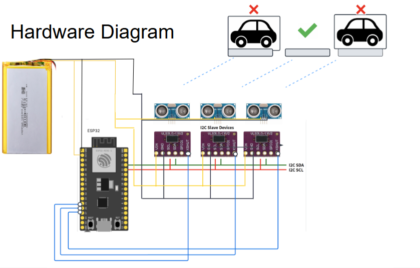
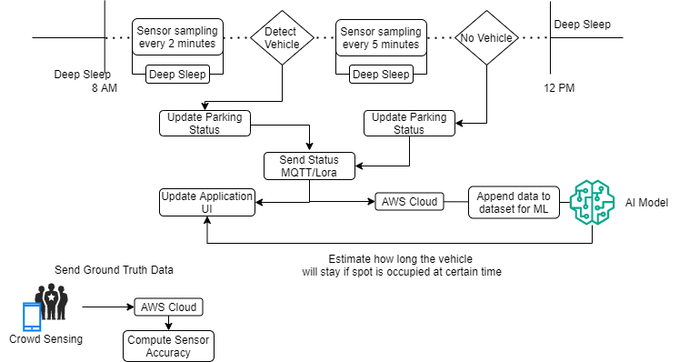
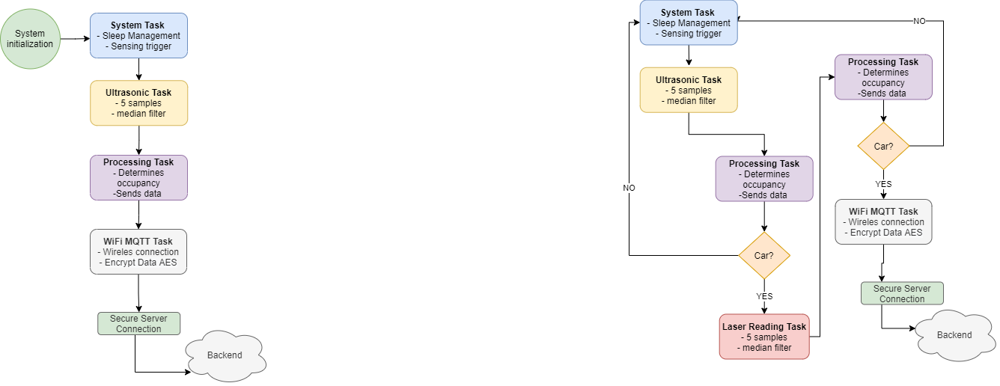

# IoT Smart Parking System


### Group Members

| Name           | LinkedIn                                        | GitHub                                         |
|----------------|-------------------------------------------------|------------------------------------------------|
| Najeh Alhalawani | [LinkedIn](https://www.linkedin.com/in/najeh-halawani/) | [GitHub](https://github.com/najeh-halawani)     |
| Marcelo Jimenez  | [LinkedIn](https://www.linkedin.com/in/marcelo-jimenez-b3481a185/) | [GitHub](https://github.com/MarceloJimenez) |
| Jose Edgar Hernandez Cancino        | [LinkedIn](https://www.linkedin.com/in/edgar-cancino/) | [GitHub](http://github.com/edgarcancinoe)           |

### Project Description
Current public parking systems are inefficient, causing traffic and wasted time. Using distributed IoT devices, the smart parking system provides real-time space availability, optimizing usage and reducing congestion.


## First Delivery
### Presentation
[1st Delivery Presentation](https://docs.google.com/presentation/d/1VHvnea2nDiLjKaK5B2iErumbn9hpuVL7MPw8SApzhms/edit?usp=sharing)
[1st Delivery Document Report](https://docs.google.com/document/d/10ruJmEqlc8Oc96KXyhO19T9GCGOf3zeflkNzlUUKl-4/edit?usp=sharing)


https://learn.adafruit.com/adafruit-vl53l1x/arduino

## Second Delivery
### Presentation 
[2nd Delivery Presentation](https://docs.google.com/presentation/d/1vtUditZ_Z3u_01ClWB8TNgsbasLDgdu5vdAYTphrPOQ/edit?usp=sharing)

## Final Delivery
### Presentation 
[Final Delivery Presentation](https://docs.google.com/presentation/d/1S8vl5cQRdb_BTN5ShN8jQxkhQOtSf8Ni4pGKuB8OlaQ/edit?usp=sharing)


# IoT Smart Parking System 🚗📡

Final delivery of our IoT group project at Sapienza University of Rome. This project aims to detect parking spot occupancy using a hybrid sensor approach (ultrasonic + ToF), powered by low-energy microcontrollers, and transmitting data securely via LoRa and Wi-Fi/MQTT.

## 🧠 Project Overview

We designed and deployed a smart sensing platform to:
- Detect parking spot occupancy with ≥90% accuracy.
- Transmit data wirelessly in near real-time.
- Visualize availability and collect user-validated reports via mobile crowdsensing.

Prototype tested outside the DIAG building using a single node mounted on the curb.

---

## ✅ Functional Requirements

| Code | Description |
|------|-------------|
| FR-1 | Detect vehicle presence with ≥90% accuracy |
| FR-2 | Update cloud within 5 minutes + 5 seconds after occupancy change |
| FR-3 | Secure data transmission and server connection |

---

## ⚙️ Non-Functional Requirements

| Code | Description |
|------|-------------|
| NFR-1 | ≥120 days autonomy with a 3.7 V 10,000 mAh LiPo battery |
| NFR-2 | BOM ≤ €20 per node  |
| NFR-3 | Support ≥4 sensors per MCU |

---

## 🛠️ Hardware Components

| Component | Description | Price (est.) |
|----------|-------------|--------------|
| ESP32 LoRa Heltec V3 | MCU with LoRa SX1262 | €17.50 |
| VL53L1X | ToF Laser sensor | €4.18 |
| HC-SR04 | Ultrasonic sensor | €1.59 |
| LiPo 3.7V 10,000 mAh | Battery | €9.39 |
| IP65 Enclosure | Weatherproof housing | €2.07 |


---

## ⚙️ Technical Implementation Details

### System Overview

---


### Firmware Architecture

- **Platform:** ESP32 Heltec LoRa V3, programmed with PlatformIO (Arduino framework)
- **RTOS:** FreeRTOS with dual-core task separation

#### Core 0
- **systemTask:** Manages system state, triggers sensor sampling, and coordinates light/deep sleep cycles.
- **processingTask:** Fuses sensor data, applies occupancy logic with hysteresis, and queues updates for communication.
- **deepSleepTask:** Handles deep sleep transitions for power saving.

#### Core 1
- **usSensorTask:** Polls ultrasonic sensors, applies median filtering, and sends readings to queues.
- **laserTask:** Polls VL53L0X ToF sensors, applies median filtering, and sends readings to queues.
- **wifiMQTTTask:** Handles WiFi/MQTT connectivity, encrypts and publishes data to the cloud.

#### Inter-Task Communication
- **Queues:** Used for passing sensor readings and processed occupancy data between tasks.
- **Notifications:** Used for task synchronization (e.g., systemTask notifies sensor tasks to start sampling).

---

---

### Sensor Fusion & Occupancy Logic

- **Sensors:** Each parking spot uses both an ultrasonic (HC-SR04) and a VL53L0X ToF sensor.
- **Sampling:** Each sensor takes 5 readings per cycle; the median value is used.
- **Logic:** 
  - Ultrasonic sensor triggers a "potential occupancy" event.
  - ToF sensor confirms occupancy if the ultrasonic threshold is crossed.
- **Data Structure:** Each update includes spot ID, occupancy state, both sensor distances, and a timestamp.

---


### Secure Data Transmission

- **Encryption Pipeline:**
  1. Sensor data is serialized as JSON.
  2. PKCS7 padding is applied to align with AES block size.
  3. Data is encrypted using AES-256 in CBC mode with a unique IV per message.
  4. The IV is prepended to the ciphertext.
  5. The combined payload is published over MQTT (optionally over TLS).

- **Decryption in the Cloud:**
  1. Extract the first 16 bytes as the IV.
  2. Decrypt the remaining bytes using AES-256-CBC and the shared key.
  3. Remove PKCS7 padding.
  4. Parse the resulting JSON.

---

### Power Management

- **Deep Sleep:** Node enters deep sleep for configurable intervals (default: 120 seconds) to maximize battery life.
- **Sampling Intervals:** Adaptive based on occupancy state (longer when vacant, shorter when occupied).
- **Watchdog:** Hardware watchdog is enabled to ensure system reliability.

---

### Key Files

- `main.cpp`: System initialization and FreeRTOS task creation
- `system_task.h`: System management and task coordination
- `processing.h`: Sensor fusion and occupancy logic
- `sensor_ultrasonic.h` / `sensor_laser.h`: Sensor drivers
- `wifi_comms.h`: WiFi/MQTT communication and encryption
- `aes.h` / `aes.cpp`: AES-256 encryption implementation
- `config.h`: System configuration and constants

---

## 🧪 Field Test Results

| Metric        | Value            |
|---------------|------------------|
| Accuracy      | ≈91.7% (33/36)   |
| Confidence CI | ±8% @ 95% level  |
| Test Duration | 6 minutes        |
| Repetitions   | 36 transitions   |

📊 [Confusion Matrix](#)

---

## 📱 Frontend

- Displays real-time parking availability
- Enables user ground-truth validation via photo
- Rewards validation with temporary app features

---

## 🔋 Battery Projection

With deep sleep cycles and efficient polling, our system can run for over **180 days** without charging or maintenance.

---

## 🧪 Requirement Verification

| Requirement | Met | Verification |
|-------------|-----|--------------|
| FR-1        | ✅  | Field tests  |
| FR-2        | ✅  | RTOS logic   |
| FR-3        | ✅  | Encrypted MQTT |
| NFR-1       | ✅  | Battery simulation |
| NFR-2       | ✅  | BOM check |
| NFR-3       | ✅  | I²C Multiplexing |

---

## 📁 Repository Structure

```bash
📦smart-parking-iot
 ┣ 📂firmware
 ┃ ┣ 📜main.cpp
 ┃ ┣ 📜tasks.cpp
 ┃ ┗ 📜config.h
 ┣ 📂frontend
 ┃ ┗ 📜app_mockup.png
 ┣ 📂docs
 ┃ ┗ 📜IoT_Presentation.pdf
 ┣ 📜README.md
 ┗ 📜LICENSE
```

---

## 📄 License

MIT License. See `LICENSE` file.